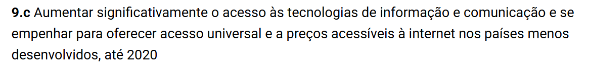
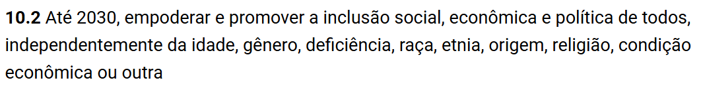

# Fase 1

## 1. Contextualização do Objeto de Avaliação

### 1.1. Descrição Estruturada do Software Selecionado
O **Mozilla Firefox** é um navegador web de código aberto, multiplataforma, desenvolvido e mantido pela Mozilla Foundation. É amplamente utilizado em desktops e dispositivos móveis, sendo uma peça fundamental da infraestrutura digital global.

A escolha do Firefox para esta avaliação se justifica por três pilares centrais:
-   **Relevância global:** O navegador desempenha um papel notório na promoção de um ecossistema digital aberto e competitivo.
-   **Desenvolvimento contínuo e comunidade ativa:** O Firefox possui um ciclo de desenvolvimento rápido e uma comunidade de contribuidores robusta, o que garante a disponibilidade de vasta documentação pública e dados de bugs, como os encontrados no Bugzilla.[[1]](#ref-1), [[2]](#ref-2)
-   **Diversidade de ambientes de execução:** Sua natureza multiplataforma permite a coleta de métricas concretas e comparáveis em diferentes sistemas operacionais.

Do ponto de vista técnico, a arquitetura moderna do Firefox é baseada em um modelo **multi-processo**, que isola a interface do navegador dos conteúdos web.[[3]](#ref-3) Essa separação, que utiliza componentes como o motor de renderização **Gecko** e o motor JavaScript **SpiderMonkey**, é projetada para melhorar a estabilidade e a segurança, mas introduz um *trade-off* com o consumo de recursos.[[4]](#ref-4)

### 1.2. Requisitante
- **Mozilla**: Possui autoridade direta sobre o Firefox, garantindo financiamento, definição de prioridades e direção do projeto. É o requisitante principal, pois encomenda e supervisiona o projeto, buscando que o navegador seja eficiente e acessível para todos.

### 1.3 Partes interessadas

- **Usuários**: Impactam diretamente o desenvolvimento com feedback e uso contínuo. Esperam um navegador com um tempo de resposta curto, que consuma pouca memória e CPU e que funcione em diferentes dispositivos. Sua influência é preceptível nas decisões de desempenho e priorização de melhorias.  

- **Equipe interna do firefox**: atua na implementação, manutenção e decisões oficiais do navegador, garantindo o bom funcionamento do produto. É responsável por definir prioridades técnicas e estratégicas. Sua influência é direta sobre o escopo das funcionalidades e sobre a qualidade final do software.

- **Comunidade open source**: Contribui com código, testes e documentação, ajudando na evolução do Firefox. Buscam participar do desenvolvimento e implementar melhorias. Influenciam diretamente o projeto por meio de sugestões e contribuições práticas.

- **Instituições que utilizam o Firefox**: Dependem do navegador e influenciam indiretamente. Esperam que o software funcione corretamente em seus sistemas, sem decidir funcionalidades.  

- **Parceiros comerciais**: Interessados em parcerias ou divulgação, buscam associar-se a um navegador bem avaliado e acessível. Influenciam de forma indireta, podendo sinalizar necessidades de portabilidade para uma maior divulgação, mas não impacta diretamente em decisões do desenvolvimento.

Os usuários do navegador, equipe interna do firefox e a comunidade open source são as partes interessadas principais, pois influenciam diretamente no desenvolvimento e operação do produto, influenciando suas funcionalidades e qualidade. Já as instituições e parceiros comerciais influenciam de forma mais indireta, afetando decisões estratégicas, mas não o funcionamento em si do produto.

### 1.3. Classificação e Arquitetura do Produto

O Firefox é um navegador de código aberto criado pela Mozilla Foundation, capaz de ser usado em diversas plataformas, como Windows, Linux e macOS. Trata-se de um software multiplataforma, distribuído e de código aberto, onde o domínio de atuação envolve o acesso à internet, produtividade e comunicação. O front-end do navegador é composto por XUL, HTML, CSS e JavaScript, enquanto o back-end utiliza linguagens como C++, Python e Rust.

#### 1.3.1 Módulos Principais
O Firefox é composto por diferentes módulos que organizam suas funcionalidades principais, são eles:

- **Gerenciamento de Abas e Janelas**: Controla múltiplas abas, como histórico, favoritos e sessões.  
- **Segurança e Privacidade**: Garante proteção contra rastreamento e gerencia permissões de sites.  
- **Sistema de Extensões**: Permite funcionalidades extras via extensões.  

### 1.3.2 Interfaces
 interfaces do Firefox representam os pontos de contato entre o navegador e seus usuários, permitindo interação direta e configuração de recursos. São eles:

- **Interface de Usuário (IU/UX)**: Barra de endereços, abas, menus, área de exibição das páginas, painéis de favoritos e histórico.  
- **Interface de Configurações**: Telas para ajustes de privacidade, desempenho, aparência e gerenciamento de contas.  

### 1.3.3 Dependências
O FireFox precisa de alguns recursos para funcionar e ser utilizado devidamente, são eles:

- **Conexão com a Internet**: Necessária para carregar páginas web, verificar atualizações e sincronizar dados.  
- **Permissões básicas do sistema**: Acesso à tela, rede e dispositivos de entrada como mouse, teclado ou toque.
- **Bibliotecas de Sistema**: O FireFox possui diversas bibliotecas necessárias para o seu funcionamento, como de renderização de imagem, mídia e etc.

## 2. Planejamento da Avaliação de Qualidade

### 2.1. Modelo de Qualidade de Referência
O modelo de qualidade que servirá como base para esta avaliação é o da norma **ISO/IEC 25010**. Suas características de qualidade de produto fornecem uma visão abrangente que será priorizada na seção seguinte para definir o foco do trabalho.

### 2.2. Priorização das Características com o Método MoSCoW

Para garantir que o foco da avaliação de qualidade do Firefox estivesse alinhado com os objetivos do projeto e as necessidades das partes interessadas, foi utilizado um método de priorização estruturado. A abordagem escolhida foi o **MoSCoW**, um acrônimo que classifica os requisitos em quatro categorias, permitindo uma tomada de decisão clara sobre o que é essencial e o que pode ser deixado para avaliações futuras.

O método MoSCoW organiza as características da seguinte forma:
* **MH - Must Have (Deve Ter):** Requisitos críticos e inegociáveis para o sucesso da avaliação. Se estes não forem atendidos, a avaliação é considerada um fracasso. São as características que entregam o maior valor e respondem diretamente ao propósito principal do projeto.
* **SH - Should Have (Deveria Ter):** Requisitos importantes, mas não vitais. A avaliação ainda seria bem-sucedida sem eles, mas sua inclusão agregaria um valor significativo. São de alta prioridade, mas podem ser contornados ou adiados se necessário.
* **CH - Could Have (Poderia Ter):** Requisitos desejáveis, mas de baixo impacto. São considerados bons de ter e só seriam incluídos se houvesse tempo e recursos disponíveis, sem comprometer os requisitos de maior prioridade.
* **WH - Won't Have (Não Terá):** Requisitos que foram explicitamente definidos como fora do escopo para este ciclo de avaliação. A categoria "Won't Have" é fundamental, pois não significa que a característica nunca será avaliada, mas sim que ela não será abordada *agora*, garantindo que a equipe mantenha o foco no que foi acordado.

A aplicação do MoSCoW é particularmente relevante neste contexto por fornecer uma linguagem comum e transparente para definir o escopo da avaliação, garantindo que os esforços se concentrem nas características que, segundo os stakeholders e o propósito declarado, são fundamentais para um navegador web moderno: seu desempenho e seu alcance democrático.

A tabela a seguir apresenta a priorização de todas as características de qualidade de produto da norma ISO/IEC 25010 aplicadas ao Firefox.

| Característica de Qualidade | Prioridade (MoSCoW) |
| :-------------------------- | :------------------ |
| Eficiência de Desempenho    | **Must Have** |
| Portabilidade               | **Must Have** |
| Segurança                   | **Should Have** |
| Confiabilidade              | **Should Have** |
| Adequação Funcional         | **Should Have** |
| Compatibilidade             | **Could Have** |
| Manutenibilidade            | **Could Have** |
| Usabilidade                 | **Won't Have** |

---
#### Justificativa da Priorização

A classificação de cada característica foi definida a partir do contexto do Mozilla Firefox como um produto de software global e do propósito principal desta avaliação.

* **Must Have (Essencial):** As características **Eficiência de Desempenho** e **Portabilidade** são a espinha dorsal da experiência do usuário e da missão do Firefox. Um navegador lento, que consome recursos excessivos (CPU, memória) ou que não funciona em uma vasta gama de sistemas e dispositivos, falha em seu propósito fundamental. Por isso, a avaliação dessas duas características é inegociável para determinar a qualidade do produto no cenário atual.
* **Should Have (Recomendado):** Nesta categoria estão **Segurança**, **Confiabilidade** e **Adequação Funcional**. A **Segurança** é vital para um navegador, mas para o escopo deste trabalho, focado em métricas de desempenho, ela se torna secundária. **Confiabilidade** (operar sem falhas) e **Adequação Funcional** (renderizar páginas corretamente) são igualmente importantes. No entanto, como o Firefox é um produto maduro, partimos do pressuposto que ele já possui um alto nível de qualidade nesses quesitos, tornando a medição deles importante, mas não tão urgente quanto a de desempenho.
* **Could Have (Desejável):** **Compatibilidade** (coexistir com outros softwares) e **Manutenibilidade** (facilidade de modificar o código) são importantes, mas têm um impacto menos direto no usuário final, que é o foco da nossa avaliação. A manutenibilidade é uma grande preocupação para os desenvolvedores do projeto, mas uma avaliação externa como esta pode deixá-la em segundo plano para focar em características mais perceptíveis pelo público.
* **Won't Have (Fora de Escopo):** A **Usabilidade** foi classificada aqui para cumprir as premissas obrigatórias do projeto, que proibiam explicitamente a escolha desta característica.

### 2.3. Escopo e Profundidade da Avaliação
-   **Escopo:** A avaliação focará nas características de **Eficiência** e **Portabilidade** do Firefox nos sistemas operacionais **Windows, Linux, macOS e Android**. A escolha destas características foi justificada pela priorização MoSCoW, que as identificou como necessárias para o projeto.
    - O critério para focar em **Eficiência** é seu impacto direto na experiência do usuário, onde um navegador lento leva à frustração e abandono do produto.
    - O critério para focar em **Portabilidade** é a democratização do acesso, garantindo que o software funcione em uma vasta gama de hardwares e sistemas.
-   **Profundidade:** A avaliação será realizada por meio de métricas objetivas (tempo em milissegundos, uso percentual de CPU/memória, sucesso em instalação/atualização).
    - Para **Eficiência**, a aplicação consistirá em medir o tempo de carregamento, inicialização e uso de recursos em diferentes cenários, utilizando benchmarks como **Speedometer** e **JetStream** [[5]](#ref-5), e utilitários de sistema (`typeperf` no Windows [[6]](#ref-6), `top` [[7]](#ref-7) e `vmstat` [[8]](#ref-8) no Linux) para monitoramento de recursos.
    - Para **Portabilidade**, a aplicação se dará pela comparação dos processos de instalação, atualização e compatibilidade nos diferentes sistemas.
-   **Objetos de avaliação:** Será considerada a versão estável mais recente do Firefox até o dia 1º de outubro de 2025, que é a versão 143.0.3. Os testes serão feitos considerando diferentes ambientes como Windows, Linux, macOS e Android, tanto com extensões instaladas quanto sem elas. Essa versão foi escolhida como referência fixa para todo o estudo, atualizações que surgirem depois dessa data não farão parte da análise.

### 2.3.1 Arquitetura alinhada com escopo

Para que o documento atual se alinhe ao escopo e foque em eficiencia e portabilidade, será necessário avaliar a arquitetura do firefox, analisando documentação oficial do firefox sobre o seu projeto que está disnponibilizado no github. O código-fonte do Firefox é organizado em diferentes diretórios, que representam componentes fundamentais da sua arquitetura.  
Os principais módulos do FireFox são:

- **browser/**  
  Contém o código do front-end do Firefox para a versão desktop.

- **browser/themes/**  
  Contém imagens e arquivos CSS usados para personalizar a aparência do navegador em diferentes sistemas operacionais (Windows, Linux, macOS).

- **layout/**  
  Implementa a árvore de renderização, que define o tipo e a posição dos objetos na interface do usuário, além de gerenciar operações sobre essa árvore.

- **js/src/**  
  Também chamado de SpiderMonkey, é o motor JavaScript do Firefox.

- **netwerk/**  
  Conhecida como Necko, é η bibliotecа de rede do Firefox dentro do motor de renderização Gecko, responsável por implementar os protocolos de rede da web.

o conhecimento prévio das pastas e o que cada uma faz irá ajudar no direcionamento da equipe. 

## 3. Propósito e Relevância da Avaliação

### 3.1. Propósito

 O nosso propósito é avaliar a qualidade do software Firefox, um navegador multiplataforma de código aberto, e analisar com foco nas características de eficiência e portabilidade levando em consideração seu uso em diferentes plataformas e cenários.  

Os resultados dessa avaliação interessam toda a comunidade que utiliza o navegador Firefox, pois poderão ter acesso a informações relevantes sobre o desempenho da aplicação, sua capacidade de adaptação a diferentes sistemas operacionais e dispositivos, além de compreender possíveis limitações e oportunidades de melhoria. Dessa forma, a análise contribui tanto para usuários finais, que buscam uma experiência de navegação mais estável e otimizada, quanto para desenvolvedores e colaboradores do projeto, que poderão utilizar os resultados dessa avaliação para futuras evoluções do software.

### 3.2. Uso dos resultados 

  - **1. Apoiar melhorias de desempenho**: A avaliação da qualidade do Firefox permite identificar gargalos de processamento, uso de memória e tempo de resposta. Esses dados podem ser utilizados para otimizações futuras, garantindo que o navegador continue competitivo e adequado às necessidades dos usuários em diferentes dispositivos e sistemas operacionais. 
  - **2. Garantir maior inclusão digital por meio do acesso a software livre de qualidade**: Como o Firefox é um navegador de código aberto e multiplataforma, sua melhoria contínua contribui para ampliar o acesso a ferramentas digitais estáveis, seguras e de qualidade, independentemente do poder aquisitivo ou da plataforma utilizada, promovendo assim a democratização da tecnologia.  
  - **3. Estabelecer métricas auditáveis para comparações futuras**: A definição de critérios e métricas de eficiência e portabilidade permite acompanhar a evolução do navegador ao longo do tempo. Além disso, possibilita comparações transparentes com outros softwares similares, oferecendo um referencial técnico que apoia a tomada de decisões por parte da comunidade de desenvolvedores e usuários.

### 3.3. Relação com os Objetivos de Desenvolvimento Sustentável (ODS)

**ODS 9 — Indústria, Inovação e Infraestrutura:**
    Avaliar a **eficiência** do Firefox contribui para compreender como a infraestrutura digital pode ser otimizada para inovação tecnológica inclusiva, alinhando-se à Meta 9.c de aumentar o acesso a tecnologias de informação.[[9]](#ref-9)

    

**Figura 1** – Meta 9.c do Objetivo de Desenvolvimento Sustentável 9.

**Fonte:** ORGANIZAÇÃO DAS NAÇÕES UNIDAS NO BRASIL, [s.d.].

**ODS 10 — Redução das Desigualdades:**
    Avaliar a **portabilidade** garante que o navegador funcione em hardware de baixo custo, promovendo inclusão digital e equidade no acesso à informação, em conformidade com a Meta 10.2 de promover a inclusão social e econômica de todos.[[10]](#ref-10)

    

**Figura 2** – Meta 10.2 do Objetivo de Desenvolvimento Sustentável 10.

**Fonte:** ORGANIZAÇÃO DAS NAÇÕES UNIDAS NO BRASIL, [s.d.].

## 4. Tabela de Contribuição da Equipe

| Matrícula | Integrante | Principais Contribuições | Comprovação  | Contribuição  |
| :--- | :--- | :--- | :--- | :--- |
| `[231033737]` | **Artur Mendonça Arruda** | Reestruturação do documento, inclusão das ferramentas de benchmark, pesquisa e redação da metodologia MoSCoW, rastreabilidade das referências, divisão de seções para legibilidade, adição de detalhes técnicos do firefox (SpiderMonkey e Gecko). | `[https://github.com/FCTE-Qualidade-de-Software-1/2025-2_T02_JEAN-SAMMET/pull/5], [https://github.com/FCTE-Qualidade-de-Software-1/2025-2_T02_JEAN-SAMMET/pull/7]` | `30%` |
| `[Matrícula]` | **João Filipe de Oliveira Souza** | | | `%` |
| `[Matrícula]` | **Lucas Mendonça Arruda** | | | `%` |
| `[Matrícula]` | **[Nome do Quinto Integrante]** | | | `%` |
| `[Matrícula]` | **Rodrigo Mattos de F. A. Bezerra** | | | `%` |
| | **Total** | | | **100%** |

## 5. Declaração de Uso de Inteligência Artificial

Para a elaboração deste artefato, foi utilizado o auxílio de modelos de linguagem de grande escala (LLMs) como ferramentas de suporte. Especificamente, foram consultados os modelos **Google Gemini** e **OpenAI ChatGPT** para obter uma visão mais ampla e analisar diferentes perspectivas sobre a estrutura e o conteúdo do trabalho, permitindo que a equipe avaliasse qual abordagem fazia mais sentido para o projeto (o uso delas não exlui a validação humana).

O uso da inteligência artificial se concentrou em duas áreas principais:

1.  **Validação Adicional de Requisitos:** As IA's foram empregadas como ferramentas de verificação secundária para garantir que todos os requisitos e critérios de avaliação da Fase 1 do projeto estavam sendo atendidos pelo conteúdo do documento.

2.  **Análise de Coerência e Fluidez:** Os modelos foram consultados para obter uma análise sobre a estrutura lógica, a coesão entre as seções e a fluidez geral da narrativa do artefato, ajudando a identificar possíveis pontos de melhoria na organização das ideias.

Vale salientar, novamente, que as IAs atuaram exclusivamente como ferramentas de validação e sugestão. Todo o conteúdo, a redação final e as decisões estratégicas foram produzidos e validados pelos integrantes da equipe.

## Bibliografia

ISO. **ISO/IEC 25000:2014 — Systems and software engineering — Systems and software Quality Requirements and Evaluation (SQuaRE) — Guide to SQuaRE.** International Organization for Standardization, 2014. Disponível em: [https://www.iso.org/standard/64764.html](https://www.iso.org/standard/64764.html). Acesso em: 30 set. 2025.

ISO. **ISO/IEC 25010:2011 — Systems and software engineering — Systems and software Quality Requirements and Evaluation (SQuaRE) — System and software quality models.** International Organization for Standardization, 2011. Disponível em: [https://www.iso.org/standard/35733.html](https://www.iso.org/standard/35733.html). Acesso em: 30 set. 2025.

ISO. **ISO/IEC 25023:2016 — Systems and software engineering — Systems and software Quality Requirements and Evaluation (SQuaRE) — Measurement of system and software product quality.** International Organization for Standardization, 2016. Disponível em: [https://www.iso.org/standard/35746.html](https://www.iso.org/standard/35746.html). Acesso em: 30 set. 2025.

AGILE BUSINESS CONSORTIUM. *AgilePM® Agile Project Management Handbook v2*. Ashford: Agile Business Consortium, 2014. ISBN 978-1909864003.

## Referências Bibliográficas
[[1]](#cite-1-2) THE BUGZILLA PROJECT. **Bugzilla**. Disponível em: [https://www.bugzilla.org/](https://www.bugzilla.org/). Acesso em: 30 set. 2025.

[[2]](#cite-1-2) MOZILLA. **Bug Writing Guidelines**. MDN Web Docs. Disponível em: [https://developer.mozilla.org/en-US/docs/Mozilla/QA/Bug_writing_guidelines](https://developer.mozilla.org/en-US/docs/Mozilla/QA/Bug_writing_guidelines). Acesso em: 30 set. 2025.

[[3]](#cite-3) MOZILLA. **Process Model**. Firefox Source Docs. Disponível em: [https://firefox-source-docs.mozilla.org/dom/ipc/process_model.html](https://firefox-source-docs.mozilla.org/dom/ipc/process_model.html). Acesso em: 30 set. 2025.

[[4]](#cite-4) MOZILLA. **Gecko Overview**. Firefox Source Docs. Disponível em: [https://firefox-source-docs.mozilla.org/overview/gecko.html](https://firefox-source-docs.mozilla.org/overview/gecko.html). Acesso em: 30 set. 2025.

[[5]](#cite-5) BROWSERBENCH. **Browser Benchmarks: Speedometer, JetStream, MotionMark**. Disponível em: [https://browserbench.org/](https://browserbench.org/). Acesso em: 30 set. 2025.

[[6]](#cite-6) MICROSOFT. **typeperf command**. Microsoft Learn. Disponível em: [https://learn.microsoft.com/en-us/windows-server/administration/windows-commands/typeperf](https://learn.microsoft.com/en-us/windows-server/administration/windows-commands/typeperf). Acesso em: 30 set. 2025.

[[7]](#cite-7) THE LINUX MAN-PAGES PROJECT. **top(1) — Linux manual page**. Disponível em: https://man7.org/linux/man-pages/man1/top.1.html. Acesso em: 30 set. 2025.

[[8]](#cite-8) THE LINUX MAN-PAGES PROJECT. **vmstat(8) — Linux manual page**. Disponível em: https://man7.org/linux/man-pages/man8/vmstat.8.html. Acesso em: 30 set. 2025.

[[9]](#cite-9) ORGANIZAÇÃO DAS NAÇÕES UNIDAS NO BRASIL. **ODS 9: Indústria, Inovação e Infraestrutura**. Nações Unidas Brasil, [s.d.]. Disponível em: https://brasil.un.org/pt-br/sdgs/9. Acesso em: 1 out. 2025.

[[10]](#cite-10) ORGANIZAÇÃO DAS NAÇÕES UNIDAS NO BRASIL. **ODS 10: Redução das Desigualdades**. Nações Unidas Brasil, [s.d.]. Disponível em: https://brasil.un.org/pt-br/sdgs/10. Acesso em: 1 out. 2025.

## Histórico de Versões

| Versão | Descrição | Autor(es) | Data | Revisor(es) | Data de Revisão |
| ------ | ------------------------------------------------ | -------------------------------------------------------------- | ---------- | ------------------------------------------------------------ | --------------- |
| 1.0 | Criação e documentação inicial da fase 1  |[João Filipe de Oliveira Souza](https://github.com/joao151104) | 29/09/2025 | | |
| 1.1 | Adição da bibliografia e do histórico de versões | [Artur Mendonça Arruda](https://github.com/ArtyMend07) | 29/09/2025 | [Lucas Mendonça Arruda](https://github.com/lucasarruda9) | 29/09/2025 |
| 1.2 | Reestruturação do documento  | [Artur Mendonça Arruda](https://github.com/ArtyMend07) e [Lucas Mendonça Arruda](https://github.com/lucasarruda9) | 29/09/2025 |  |  |
| 1.3 | Adição de detalhes técnicos, relação entre as características, e da profundidade do projeto | [Artur Mendonça Arruda](https://github.com/ArtyMend07) | 30/09/2025 | [Lucas Mendonça Arruda](https://github.com/lucasarruda9) | 30/09/2025 |
| 1.4 | Adição de hyperlinks das fontes | [Artur Mendonça Arruda](https://github.com/ArtyMend07) | 30/09/2025 | [Lucas Mendonça Arruda](https://github.com/lucasarruda9) | 30/09/2025 |
| 1.5 | Adição do Propósito da Avaliação e Usos Pretendidos | [Rodrigo Mattos de F. A. Bezerra](https://github.com/Rodrigomfab88) | 30/09/2025 | [Artur Mendonça Arruda](https://github.com/ArtyMend07) | 01/10/2025 |
| 1.6 | Adição de partes interessadas e classificação do tipo do produto | [Lucas Mendonça Arruda](https://github.com/lucasarruda9) | 01/10/2025 |  |  |
| 1.7 | Adição das imagens e bibliografia das ODS's | [Artur Mendonça Arruda](https://github.com/ArtyMend07) | 01/10/2025 | [Lucas Mendonça Arruda](https://github.com/lucasarruda9) | 01/10/2025 |
| 1.8 | Adição da priorização MOSCOW para a escolha das características de qualidade| [Artur Mendonça Arruda](https://github.com/ArtyMend07) | 01/10/2025 | [Lucas Mendonça Arruda](https://github.com/lucasarruda9) | 01/10/2025 |
| 1.9 | Reestruturação geral com títulos e seções para melhorar a legibilidade e adição de declaração de uso de IA| [Artur Mendonça Arruda](https://github.com/ArtyMend07) | 01/10/2025 | [Lucas Mendonça Arruda](https://github.com/lucasarruda9) | 01/10/2025 |