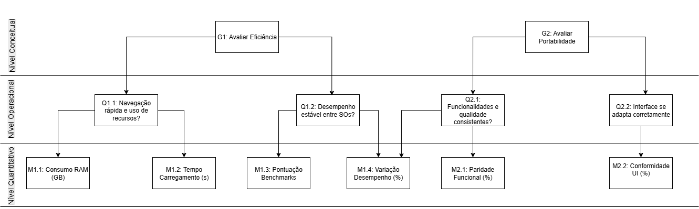

# Fase 2

## Introdução

O objetivo desta fase é definir objetivos de medição e estabelecer métricas para avaliar a qualidade do Mozilla Firefox, utilizando a abordagem GQM, que conecta metas de alto nível a métricas de avaliação. Os objetivos serão fundamentados nas prioridades identificadas na [Fase 1](fase1.md), com foco em Eficiência de Desempenho e Portabilidade, considerando as diversos pontos de vista e o contexto de uso em diferentes plataformas e dispositivos.

### 1. Eficiência de Desempenho

### 1.1 Objetivo de medição

|                     |                           |
|---------------------|---------------------------|
| Analisar | Navegador FireFox |
| Do propósito de | Avaliar |
| Com respeito a | Eficiência de desempenho |
| Do ponto de vista do | Time de desenvolvimento |
| No contexto da | Disciplina de Qualidade de Software |

### 1.2 Questões e Hipóteses de medição

- **Questão 1.1:** O Firefox oferece uma navegação rápida e responsiva, atendendo às expectativas do usuário final?

    - **Hipótese 1.1:** Em pelo menos 90% dos testes realizados, o Firefox carrega páginas em menos de 3 segundos e mantém o consumo médio de memória abaixo de 1 GB durante a navegação comum (até 10 abas abertas). A percepção de fluidez pelos usuários é superior a 90% nas avaliações de desempenho.

- **Questão 1.2:** O Firefox mantém desempenho estável e consistente entre diferentes sistemas operacionais e dispositivos?

    - **Hipótese 1.2:** A variação de desempenho entre sistemas operacionais é inferior a 10% e o tempo de resposta médio permanece dentro dos limites aceitáveis (até 3,5 segundos). Em avaliações subjetivas, pelo menos 90% dos usuários relatam experiência semelhante de desempenho entre plataformas.

### 1.3 Métricas 

  - **M1.1: Consumo de Memória (RAM):** Medido em Gigabytes (GB), avalia a quantidade de memória que o navegador utiliza durante um cenário de uso padrão (ex: 5 a 10 abas abertas).
  - **M1.2: Tempo de Carregamento de Página:** Medido em segundos (s), corresponde ao tempo decorrido desde a solicitação de uma página até sua renderização completa.
  - **M1.3: Pontuação em Benchmarks de Desempenho:** Utilização de ferramentas padronizadas da indústria para obter uma pontuação objetiva.
      - **Speedometer 3.0:** Mede a responsividade de aplicações web complexas.
      - **JetStream 2.2:** Avalia o desempenho de JavaScript e WebAssembly em tarefas computacionalmente intensivas.
  - **M1.4: Variação de Desempenho entre Plataformas:** Medida em percentual (%), calcula a diferença relativa nas pontuações de benchmark (M1.3) entre diferentes sistemas operacionais (Windows, macOS, Linux).

### 2. Portabilidade

### 2.1 Objetivo de medição

|                     |                           |
|---------------------|---------------------------|
| Analisar | Navegador FireFox |
| Do propósito de | Avaliar |
| Com respeito a | Portabilidade |
| Do ponto de vista do | Time de desenvolvimento |
| No contexto da | Disciplina de Qualidade de Software |

### 2.2 Questões e Hipóteses de medição

- Questão 2.1: O Firefox mantém suas principais funcionalidades e qualidade de uso de forma consistente em diferentes plataformas e dispositivos?

    - **Hipótese 2.1:** O Firefox preserva 100% das funcionalidades essenciais (favoritos, histórico, extensões, sincronização) em todas as plataformas. A diferença na pontuação média de satisfação entre versões desktop e mobile é inferior a 10%.

- **Questão 2.2:** O Firefox adapta corretamente sua interface e experiência de uso em diferentes dispositivos?

    - **Hipótese 2.2:** O Firefox apresenta comportamento visual e funcional consistente em 95% dos dispositivos testados, sem distorções de layout ou falhas de interação. Pelo menos 90% dos usuários avaliam positivamente a adaptação da interface em diferentes tamanhos de tela.

## 2.3 Métricas de Avaliação

Para responder às questões e validar as hipóteses, foram selecionadas as seguintes métricas quantitativas e qualitativas, alinhadas com a metodologia GQM.

As métricas de portabilidade avaliam a subcaracterística de **Adaptabilidade**.

  - **M2.1: Paridade Funcional entre Plataformas:** Medida em percentual (%), quantifica a proporção de funcionalidades essenciais disponíveis e consistentes em todas as plataformas suportadas (desktop e mobile).
  - **M2.2: Conformidade da Interface do Usuário (UI):** Medida em percentual (%), avalia o grau em que a interface se adapta corretamente a diferentes resoluções de tela e segue as convenções de cada sistema operacional, com base em um checklist de verificação.

### 3. Níveis de Pontuação

Nesta etapa, são estabelecidos os **níveis de pontuação** para cada métrica identificada, permitindo avaliar de forma objetiva e comparável a qualidade do Mozilla Firefox quanto à **Eficiência de Desempenho** e **Portabilidade**.

A definição desses níveis busca **converter valores numéricos em interpretações qualitativas** — *Excelente*, *Bom*, *Regular* e *Insatisfatório* — de modo que os resultados obtidos nos testes possam ser analisados de maneira uniforme.

A seguir, são apresentadas as escalas de pontuação correspondentes a cada métrica definida:

| **Métrica** | **Excelente (4)** | **Bom (3)** | **Regular (2)** | **Insatisfatório (1)** |
|:--:|:--|:--|:--|:--|
| **M1.1 – Consumo de Memória (RAM)** | ≤ 1,0 GB | 1,1 – 1,5 GB | 1,6 – 2,0 GB | > 2,0 GB |
| **M1.2 – Tempo de Carregamento de Página** | ≤ 2,0 s | 2,1 – 3,0 s | 3,1 – 4,0 s | > 4,0 s |
| **M1.3 – Pontuação em Benchmarks (Speedometer / JetStream)** | ≥ 90 % da média de referência | 75 % – 89 % | 60 % – 74 % | < 60 % |
| **M1.4 – Variação de Desempenho entre Plataformas** | ≤ 10 % | 11 % – 15 % | 16 % – 20 % | > 20 % |
| **M2.1 – Paridade Funcional entre Plataformas** | 100 % | 95 % – 99 % | 85 % – 94 % | < 85 % |
| **M2.2 – Conformidade da Interface do Usuário (UI)** | ≥ 95 % | 85 % – 94 % | 70 % – 84 % | < 70 % |

## 4.Critérios de Avaliação e Julgamento

### 4.1 Consolidação dos Resultados

Cada métrica (M1.1 a M2.2) utiliza uma **escala de 1 a 4**:

| Pontuação | Nível Qualitativo | Interpretação |
|:--:|:--|:--|
| 4 | Excelente | Supera ou iguala os valores-alvo, alta conformidade. |
| 3 | Bom | Atende satisfatoriamente aos critérios. |
| 2 | Regular | Abaixo do esperado, com limitações. |
| 1 | Insatisfatório | Não atende aos critérios mínimos. |

### 4.2 Índice de Qualidade por Característica

Para cada característica, calcula-se a média ponderada das métricas:

\[
IQ_c = \frac{\sum (P_i \times w_i)}{\sum w_i}
\]

- \(IQ_c\) = Índice de Qualidade da característica  
- \(P_i\) = Pontuação da métrica \(i\)  
- \(w_i\) = Peso da métrica (igual a 1 se não houver ponderação)

### 4.3 Interpretação do Índice

| Intervalo | Nível | Interpretação |
|:--:|:--|:--|
| 3,5 – 4,0 | Excelente | Desempenho e portabilidade excelentes. |
| 2,5 – 3,4 | Bom | Atende adequadamente aos critérios. |
| 1,5 – 2,4 | Regular | Limitações perceptíveis; requer otimização. |
| 1,0 – 1,4 | Insatisfatório | Não atende aos requisitos mínimos. |

### 4.4 Índice Global de Qualidade (IQG)

\[
IQG = \frac{IQ_{Desempenho} + IQ_{Portabilidade}}{2}
\]

Avalia a **qualidade geral do Firefox**, permitindo comparação entre versões e identificação de oportunidades de melhoria.

### 4.5 Critérios de Aceitação

- **Aceito:** \(IQG ≥ 2,5\)  
- **Aceito com recomendações:** \(2,0 ≤ IQG < 2,5\)  
- **Rejeitado:** \(IQG < 2,0\)  

## 5. Diagrama GQM

O diagrama abaixo apresenta a representação visual da hierarquia GQM (Goal-Question-Metric) adotada neste plano de medição. O diagrama ilustra como os Objetivos de Medição de alto nível (Eficiência e Portabilidade) são decompostos em Questões específicas para avaliação. Por sua vez, cada Questão é conectada às Métricas quantitativas que fornecerão os dados necessários para respondê-las. A estrutura evidencia os três níveis lógicos da abordagem GQM, sendo eles o Conceitual (Objetivos), Operacional (Questões) e Quantitativo (Métricas).

**Figura 1** – Diagrama GQM representando a hierarquia de Objetivos, Questões e Métricas.

**Fonte:** Elaborado pelos autores [Artur Mendonça Arruda](https://github.com/ArtyMend07) e [Lucas Mendonça Arruda](https://github.com/lucasarruda9) (2025).

## 6. Declaração de Uso de Inteligência Artificial

Para elaborar este artefato, a equipe contou com o apoio de modelos de linguagem de grande escala (LLMs), em especial o **ChatGPT**, como ferramenta auxiliar. O objetivo foi obter diferentes perspectivas sobre a organização e o conteúdo do trabalho, complementando a análise feita pelos integrantes do projeto.

O uso da IA se concentrou em duas frentes principais:

1. **Confirmação de Requisitos:** Serviu como recurso adicional para garantir que todos os requisitos e critérios da Fase 2 do projeto estavam atendidos.

2. **Coerência e Clareza do Documento:** Auxiliou na revisão da lógica e fluidez do texto, ajudando a identificar pontos que poderiam ser ajustados para tornar o artefato mais claro e bem estruturado.

O ChatGPT atuou exclusivamente como ferramentas de validação e sugestão. Todo o conteúdo, a redação final e as decisões estratégicas foram produzidos e validados pelos integrantes da equipe.

## Tabela de Contribuição

| Matrícula | Integrante | Principais Contribuições | Comprovação | Contribuição |
| :--- | :--- | :--- | :--- | :--- |
| `[231033737]` | **Artur Mendonça Arruda** | | | `20%` |
| `[Matrícula]` | **Nayra Silva Nery** | | | `20%` |
| `[Matrícula]` | **João FIlipe de Oliveira Souza** | | | `20%` |
| `[231035464]` | **Lucas Mendonça Arruda** | | | `20%` |
| `[180108875]` | **Rodrigo Mattos de Figueiredo** | | | `20%` |
| | **Total** | | | **100%** |

## Referências

  - BASILI, V. R. et al. **The Goal/Question/Metric Paradigm**. Fraunhofer IESE, 2003.
  - BROWSERBENCH.ORG. **BrowserBench.org — Browser Benchmarks**. Disponível em: [https://browserbench.org/](https://browserbench.org/). Acesso em: 15 out. 2025.
  - ISO/IEC. **ISO/IEC 25010:2011 — Systems and software engineering — Systems and software Quality Requirements and Evaluation (SQuaRE) — System and software quality models**. International Organization for Standardization, 2011.
  - MARTINEZ, L., et al. **Assistant for the Evaluation of Software Product Quality Characteristics Proposed by ISO/IEC 25010 Based on GQM-Defined Metrics**. SEDICI, 2018.
  - TESTSIGMA. **Portability Testing: Attributes, Checklists, and Examples**. Disponível em: [https://testsigma.com/blog/portability-testing/](https://testsigma.com/blog/portability-testing/). Acesso em: 15 out. 2025.
  - VARGAS, S. A., et al. **Application of the Goal-Question-Metric (GQM) Method to Improve the Management of Software Projects**. SciELO, 2025.
  - - SOLLAMI, T.; AL-ZUBAIDI, L. **Software Quality Metrics and Evaluation Using GQM Approach**. International Journal of Computer Applications, 2019.  

## Histórico de Versões

| Versão | Descrição | Autor(es) | Data | Revisor(es) | Data de Revisão |
| ------ | ------------------------------------------------ | -------------------------------------------------------------- | ---------- | ------------------------------------------------------------ | --------------- |
| 1.0 | Criação e adição dos objetivos de medição  |[Lucas Mendonça Arruda](https://github.com/lucasarruda9) | 14/10/2025 | | |
| 1.1 | Adição das questões e hipóteses de medição  |[Rodrigo Mattos de F. A. Bezerra](https://github.com/Rodrigomfab88) | 15/10/2025 | | |
| 1.2 | Adição das seções de Métricas, Níveis de Pontuação e Critérios de Avaliação. | [Artur Mendonça Arruda](https://github.com/ArtyMend07) | 15/10/2025 | |  |
| 1.3 | Adição da Tabela de Contribuição e Referências. | [Artur Mendonça Arruda](https://github.com/ArtyMend07) | 15/10/2025 |  | |
| 1.4 | Criação dos níveis de pontuação  |[Nayra Nery](https://github.com/NayraNery127) | 15/10/2025 | | |
| 1.5 | Criação dos Criterios de Avaliação  |[João Filipe de Oliveira Souza](https://github.com/Joao151104) | 15/10/2025 | | |
| 1.6 | Criação dos Criterios de Avaliação  |[João Filipe de Oliveira Souza](https://github.com/Joao151104) | 15/10/2025 | | |
| 1.7 | Ajustes nas questões e hipóteses de medição  |[Rodrigo Mattos de F. A. Bezerra](https://github.com/Rodrigomfab88) | 18/10/2025 | | |
| 1.8 | Criação e Adição do diagrama GQM | [Artur Mendonça Arruda](https://github.com/ArtyMend07) e [Lucas Mendonça Arruda](https://github.com/lucasarruda9) | 23/10/2025 | |  |

